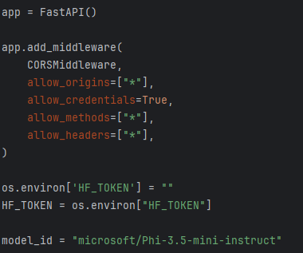
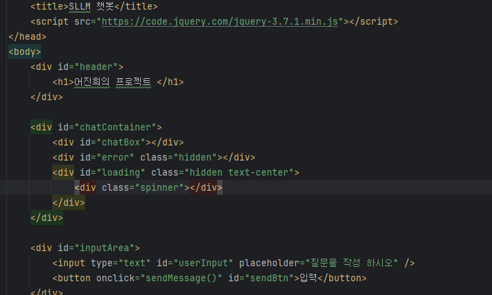
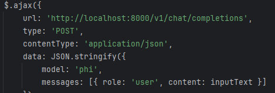
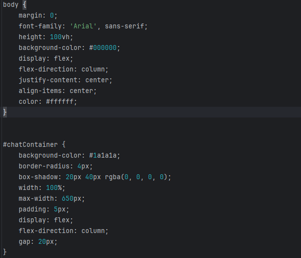
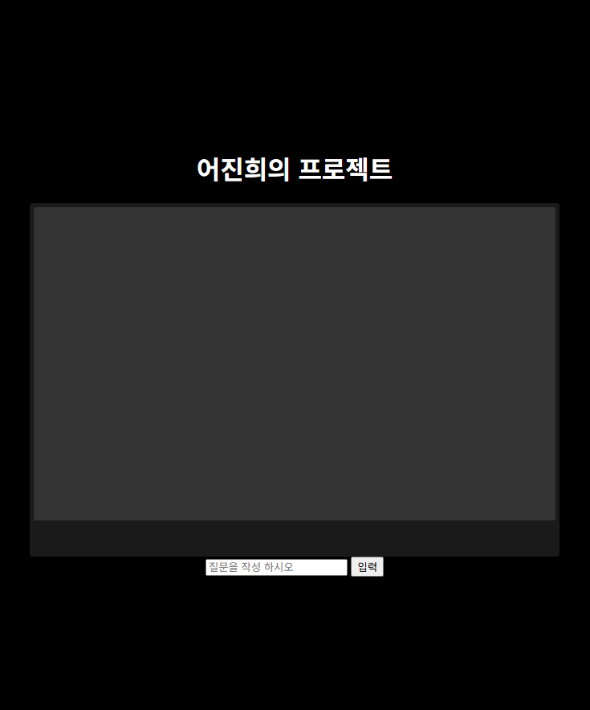

# SLLM 챗봇

### 캡스톤프로젝트2 중간고사 sLLM만들기

---

#  목차
- [프로젝트 소개](#프로젝트-소개)
- [코드](#코드)
- [실행 화면](#실행 화면)

#  프로젝트 소개
이 프로젝트는 huggingface를 이용하여 질문을 하면 AI가 답변을 제공하는 프로젝트입니다.

#  코드 

### 1. 백엔드 (`main.py`)

### 2. 프론트엔드 (`mm.html`)

### 3. JavaScript (`mm.js`)

### 4. css (`style.css`)

#  실행 화면

### 완성본

 

### 모델  [Phi-3.5-mini-instruct](https://huggingface.co/microsoft/Phi-3.5-mini-instruct)
